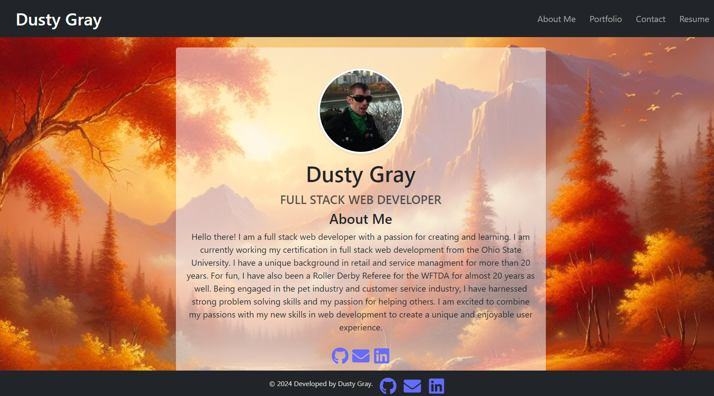
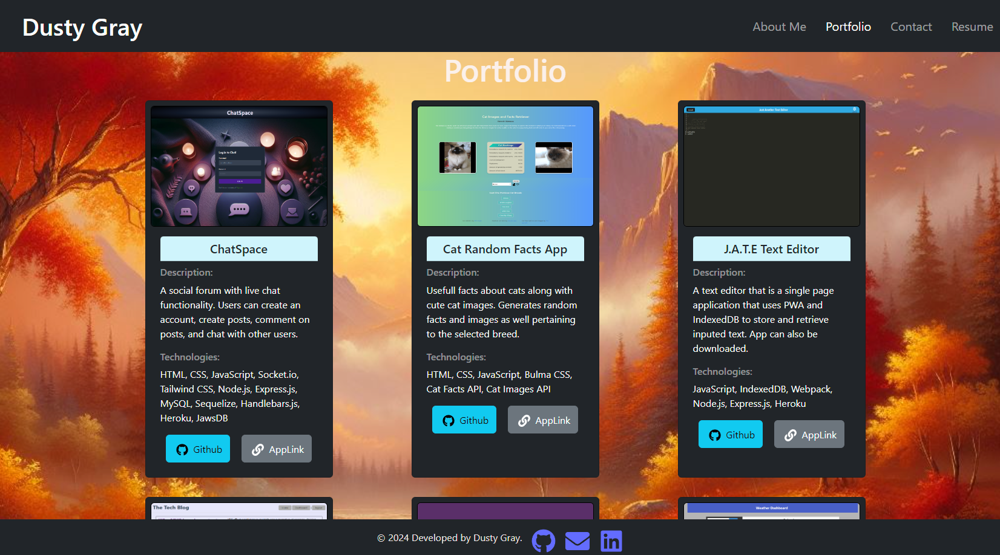
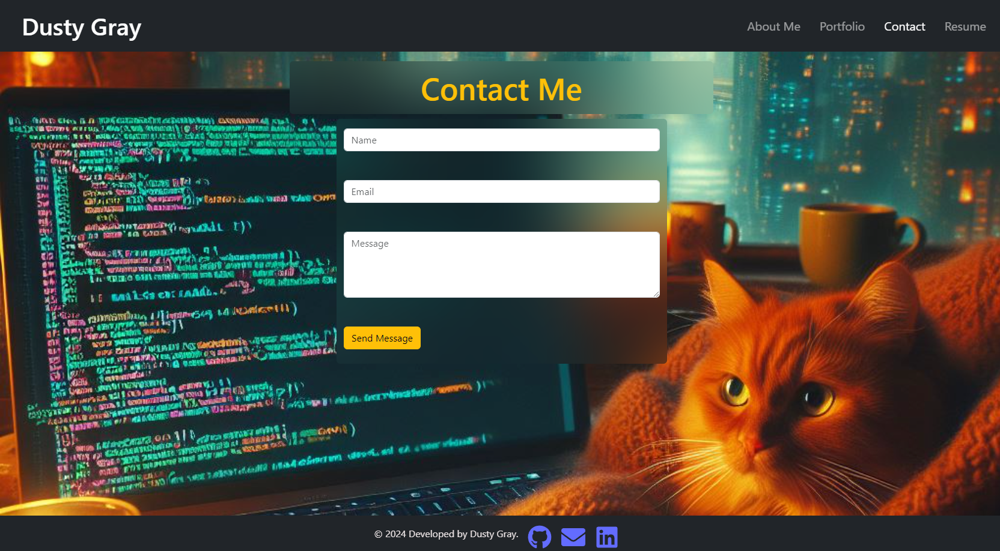
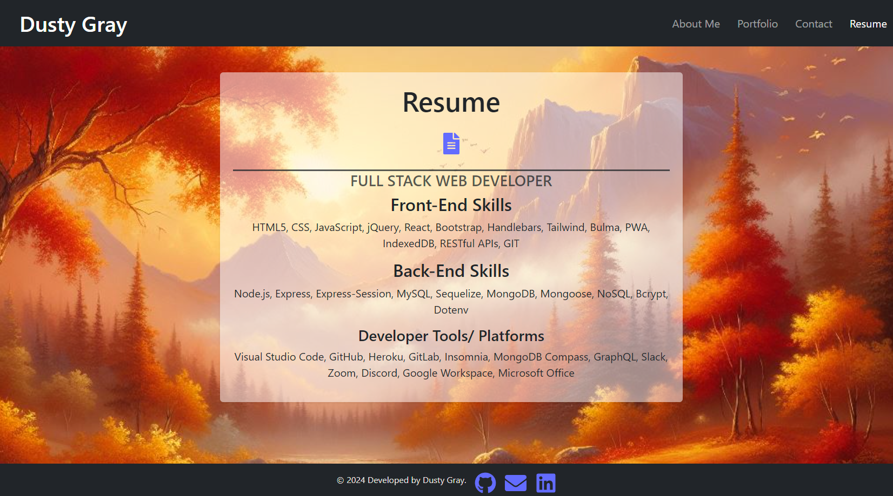
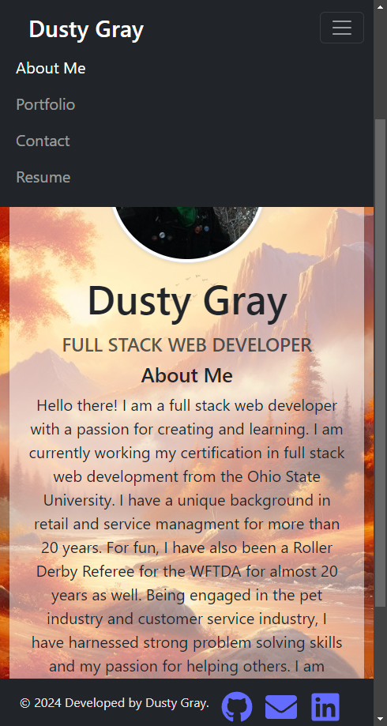
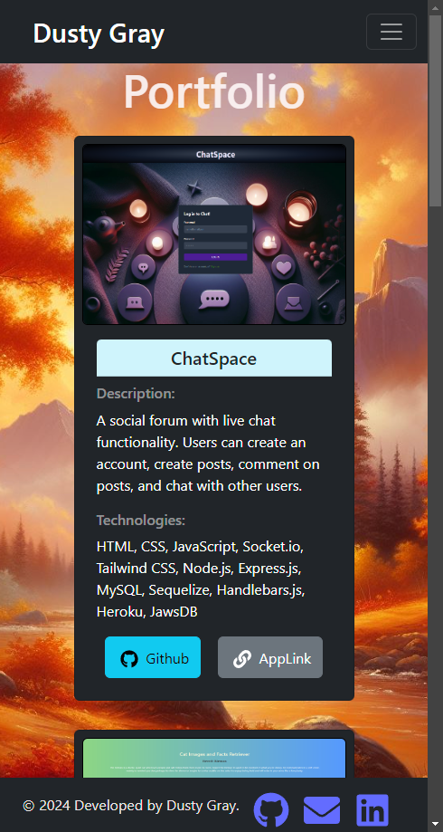

# React Portfolio 

[](https://opensource.org/licenses/MIT)   

## Table of Contents

- [Description](#description)
- [Installation](#installation)
- [Usage](#usage)
- [Screenshot](#screenshot)
- [Application Link](#application-link)
- [Credits](#credits)
- [Future Developments](#future-developments)
- [Contribute](#contribute)
- [License](#license)
- [Questions](#questions)

## Description

This single page application was an assignment from the Ohio State University Coding Bootcamp. The assignment was to create a portfolio to share my projects and resume for potential jobs or freelance work, and also to share or collaborate with other developers.  This application was built with React using Vite along with Bootstrap.  It was then deployed to [Netlify](https://www.netlify.com/).

## Acceptance Criteria

```md
GIVEN a single-page application portfolio for a web developer
WHEN I load the portfolio
THEN I am presented with a page containing a header, a section for content, and a footer
WHEN I view the header
THEN I am presented with the developer's name and navigation with titles corresponding to different sections of the portfolio
WHEN I view the navigation titles
THEN I am presented with the titles About Me, Portfolio, Contact, and Resume, and the title corresponding to the current section is highlighted
WHEN I click on a navigation title
THEN the browser URL changes and I am presented with the corresponding section below the navigation and that title is highlighted
WHEN I load the portfolio the first time
THEN the About Me title and section are selected by default
WHEN I am presented with the About Me section
THEN I see a recent photo or avatar of the developer and a short bio about them
WHEN I am presented with the Portfolio section
THEN I see titled images of six of the developer’s applications with links to both the deployed applications and the corresponding GitHub repositories
WHEN I am presented with the Contact section
THEN I see a contact form with fields for a name, an email address, and a message
WHEN I move my cursor out of one of the form fields without entering text
THEN I receive a notification that this field is required
WHEN I enter text into the email address field
THEN I receive a notification if I have entered an invalid email address
WHEN I am presented with the Resume section
THEN I see a link to a downloadable resume and a list of the developer’s proficiencies
WHEN I view the footer
THEN I am presented with text or icon links to the developer’s GitHub and LinkedIn profiles, and their profile on a third platform (Stack Overflow, Twitter)
```


## Installation
 - [Visual Studio Code](https://code.visualstudio.com/)
 - [Node.js](https://nodejs.org/en)
 - [React](https://react.dev/)
 - [Vite](https://vitejs.dev/)
 - [Bootstrap](https://getbootstrap.com/)
 - [React-router-dom](https://www.npmjs.com/package/react-router-dom/v/6.11.1)
 - To see a full list, refer to package.json files
       

## Usage

1. Clone the repository to your local computer.
2. From the root directory, run `npm install` to install dependencies.
3. Run `npm run build` to build the dist folder.
4. Run `npm start` for vite to run the application and open in the browser.


## Screenshot


<details>
  <summary>Click Arrow for Screenshot Collection</summary>
  
  
  
  
  
</details>


## Application Link

[Click here](https://dusty-gray-portfolio.netlify.app/)

## Credits

 - This application is an assignment from module 20 from [The Ohio State University Coding Boot Camp](https://eng-bootcamps.osu.edu/).  The Acceptance Criteria above is from the challenge in module 20. 
 - Activity course materials were used to help complete this application.
 - Because of deployment issues, I had to do a file restructure in this repo from my initial repo which can be found [here](https://github.com/RickiBobbii/React-Portfolio).  
 - Bing Image Creator was used for background images.
## Future Developments

  - Current resume is a placeholder, updated one coming soon
  - More styling updates
  - back-end contact form integration

## Contribute 

If you would like to contribute please use the [Contributor Covenant](https://www.contributor-covenant.org/).


## License

[](https://opensource.org/licenses/MIT)   

***MIT License***

## Questions

 - Github Profile for [rickibobbii](https://github.com/rickibobbii)